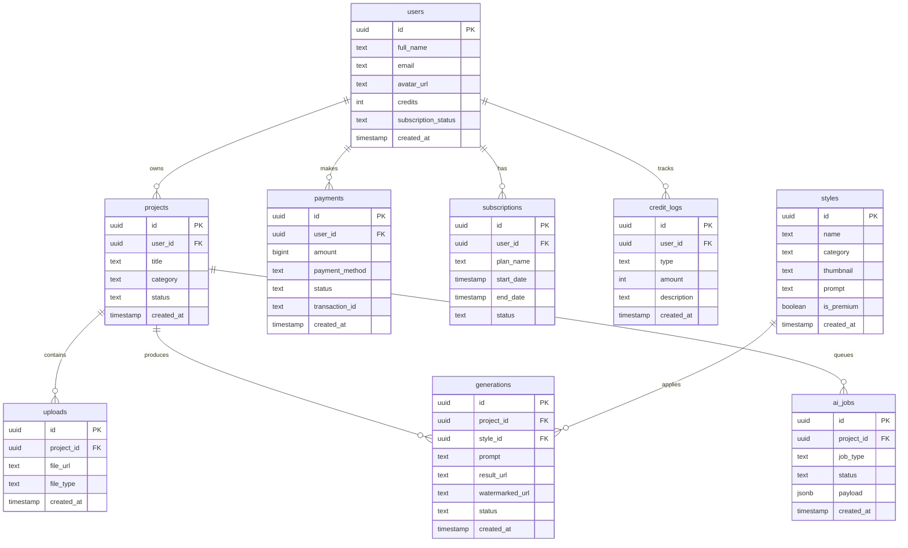

# Noir Studio AI — ERD Diagram & Supabase SQL Schema

## ERD Diagram (Mermaid)



---

## Supabase SQL Schema

```sql
create extension if not exists "pgcrypto";

create table users (
  id uuid primary key default gen_random_uuid(),
  full_name text,
  email text unique not null,
  avatar_url text,
  credits integer default 3,
  subscription_status text default 'free',
  created_at timestamptz default now()
);

create table projects (
  id uuid primary key default gen_random_uuid(),
  user_id uuid not null references users(id) on delete cascade,
  title text,
  category text,
  status text default 'draft',
  created_at timestamptz default now()
);

create table uploads (
  id uuid primary key default gen_random_uuid(),
  project_id uuid not null references projects(id) on delete cascade,
  file_url text not null,
  file_type text,
  created_at timestamptz default now()
);

create table styles (
  id uuid primary key default gen_random_uuid(),
  name text not null,
  category text,
  thumbnail text,
  prompt text not null,
  is_premium boolean default false,
  created_at timestamptz default now()
);

create table generations (
  id uuid primary key default gen_random_uuid(),
  project_id uuid not null references projects(id) on delete cascade,
  style_id uuid references styles(id) on delete set null,
  prompt text,
  result_url text,
  watermarked_url text,
  status text default 'queued',
  created_at timestamptz default now()
);

create table payments (
  id uuid primary key default gen_random_uuid(),
  user_id uuid not null references users(id) on delete cascade,
  amount bigint not null,
  payment_method text,
  status text default 'pending',
  transaction_id text unique,
  created_at timestamptz default now()
);

create table subscriptions (
  id uuid primary key default gen_random_uuid(),
  user_id uuid not null references users(id) on delete cascade,
  plan_name text not null,
  start_date timestamptz default now(),
  end_date timestamptz,
  status text default 'active'
);

create table credit_logs (
  id uuid primary key default gen_random_uuid(),
  user_id uuid not null references users(id) on delete cascade,
  type text not null,
  amount integer not null,
  description text,
  created_at timestamptz default now()
);

create table ai_jobs (
  id uuid primary key default gen_random_uuid(),
  project_id uuid not null references projects(id) on delete cascade,
  job_type text not null,
  status text default 'queued',
  payload jsonb,
  created_at timestamptz default now()
);
```

---

## Recommended Supabase Storage Buckets

- original-uploads (private)
- generated-images (private)
- watermarked-previews (public)
- videos (private)
- style-thumbnails (public)

---

## Recommended RLS Policies

- users can only read/update their own records
- users can only access their own projects
- users can only access uploads linked to their projects
- users can only access generations linked to their projects
- users can only access their own payments and subscriptions

